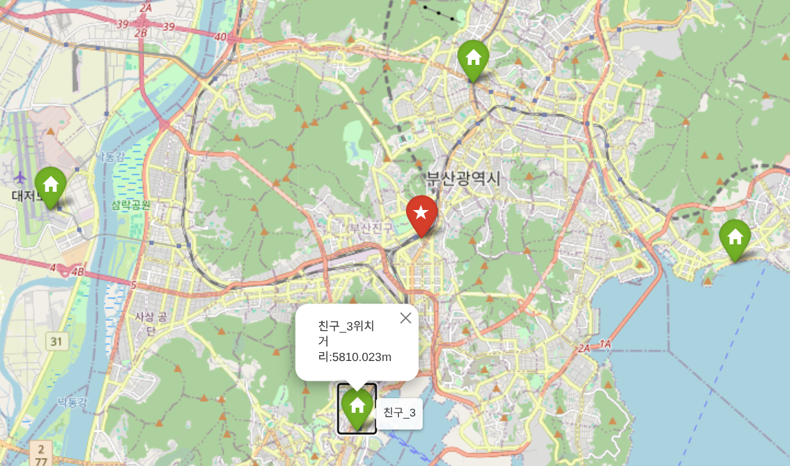

# 어디서 만나?

## 0. 프로그램에 관하여


본 프로그램은 친구들 끼리 만날 때, 모든 사람의 거리의 최소 합 만큼 떨어져 있는 곳의 위치를 알려주는 프로그램이다.


## 1. 설치 및 사용법
### 1.1 필요 라이브러리

본 프로그램은 다음과 같은 외부 라이브러리를 사용한다.
```bash
    folium==0.20.0
    numpy==2.5.1
    scipy==1.18.0
    geopy==2.5.0
```

라이브러리 버전은 현재 최신버전으로 진행하였고 이 버전만 테스트를 진행해봄
따라서 이외의 버전은 동작을 보장 할 수 없다.


각각의 라이브러리는 본 프로그램에서 다음과 같은 역할을 수행하기 위하여 선택함.

**folium**
    
지도를 생성하고 결과를 시각화 할때 사용함
지도는 [OpenStreetMap](https://www.openstreetmap.org/about)의 데이터를 사용하고, 각각의 위치에 마커를 지정하는데 사용된다.

**numpy, scipy**

본 프로그램은 각 지점간의 중간위치를 계산하기 위해 [Weiszfeld's algorithm](https://en.wikipedia.org/wiki/Geometric_median#Computation) 알고리즘을 사용하고 있음.
이 알고리즘을 계산하기 위해 numpy 와 scipy를 이용한다.

**geopy**

라이브러리의 여러 기능 중 목적지와 출발지 간의 거리를 구하기 위한 라이브러리임.
거리는 십진 위/경도 좌표계를 통해 대원 거리를 계산한다.
몇 km 이내에서는 대원거리까지 고려 안 해도 되지만, 가장 쉽게 거리를 구할 수 있어서 사용함

### 1.2. 사용법

1. 구글지도, OSM등을 이용하여 친구 집의 10진 위/경도 좌표계를 구한다. 예) "35.115437 129.040231"
2. main.py 프로그램을 실행하여 프롬프트에 따라 좌표를 입력한다.
3. 출력된 "map.html" 파일을 열어서 어디서 만나면 될지 알게된다.
4. 폴더에 동봉된 test_case.txt의 좌표는 메인에 걸린 사진에 사용된 좌표이다.
5. os에 따라서 인터넷 브라우저가 바로 켜질 수도 있고, 아닐 수도 있다.


## 2. 코드설명

본 프로그램은 사용자로 부터 2개 이상의 위/경도 좌표를 입력받은 뒤, 거리의 합의 최소치인 기하중앙값의 좌표를 계산하여 html형식의 지도를 이용하여 사용자에게 시각화 하는 프로그램 이다.
각각의 프로그램은 다음과 같은 함수로 구성되어 있다.

```bash
    geometric_median(X, eps=1e-5)
    cheak_lok(friend_loc)
    input_friend_loc()
    add_maker(friend_loc, dis_loc, map)
```

각각의 라이브러리는 본 프로그램에서 다음과 같은 역할을 수행한다.

**geometric_median(X, eps=1e-5):**
    
좌표를 받아서 가장 최소거리의 좌표를 반환하는 함수이다.

stackoverflow에서 가져온 부분이다.
인자은 np.array 2차원 배열과 정밀성과 관련된 실수이고, 출력은 np.array형식의 1차원 배열이다.
```bash
    # Source - https://stackoverflow.com/a/30305181
    # Posted by orlp, modified by community. See post 'Timeline' for change history
    # Retrieved 2026-07-14, License - CC BY-SA 3.0
```


**input_friend_loc()**

사용자로 부터 좌표를 입력받는 함수이다.
인자는 없고 출력은 좌표가 포함된 np.array형식의 2차원 배열이다.
    

**cheak_lok(friend_loc):**

nput_friend_loc()안의 함수로 사용자의 string 형식의 입력 가져와서 유효성을 확인하고 np.array형식을 반환하는 함수.
입력은 string형식이고, 출력은 np.array타입의 [위도, 경도] 이다.


**add_maker(friend_loc, dis_loc, map):**

folium로 생성된 지도에 친구들의 집과 목적지를 표시하는 함수이다.
입력은 친구들의 집의 위치, 목적지, 지도 객체이고, 출력은 없다.
    
더 자세한 설명은 코드에서 확인할 수 있다.


## 3.개선점

+ 다양한 좌표 형식 입력을 가능하게 한다 예) DMS DDM MGRS등
+ 지도가 처음 생성될 때 마커간의 거리에 따라 축척을 동적으로 실행
+ 지도에서 클릭으로 친구 집을 추가하기
+ GPS등을 이용하여 실시간으로 중점 찾기
+ 대중교통 등을 이용했을 때, 교통상항 등을 고려해서 거리에 가중치를 두기


## 4.LLM 사용처
본 프로그램을 작성하는데 몇가지 곳에서 LLM을 사용하였다.
```bash
지도상에서 여러 지점에서 출발했을 때 가장 짧은 위치 구하는 알고리즘이 무엇인지 알아내는데 사용 : Weiszfeld 알고리즘 (적절한 검색어를 찾지 못하여 제대로 검색이 안됨)
인터넷에서 찾은 함수 "geometric_median"의 입출력 형식에 관한 질문
folium 의 맵 코드 실행이 끝나면 브라우저를 통해 바로 열람이 가능하게끔 방법을 질문
```
코딩을 하면서 막히는 부분이 있을 때 과거와 달리 인터넷 검색 말고, LLM에 질문하면 문제해결 시간이 줄어들고 검색보다 더 자세히 알 수 있음.